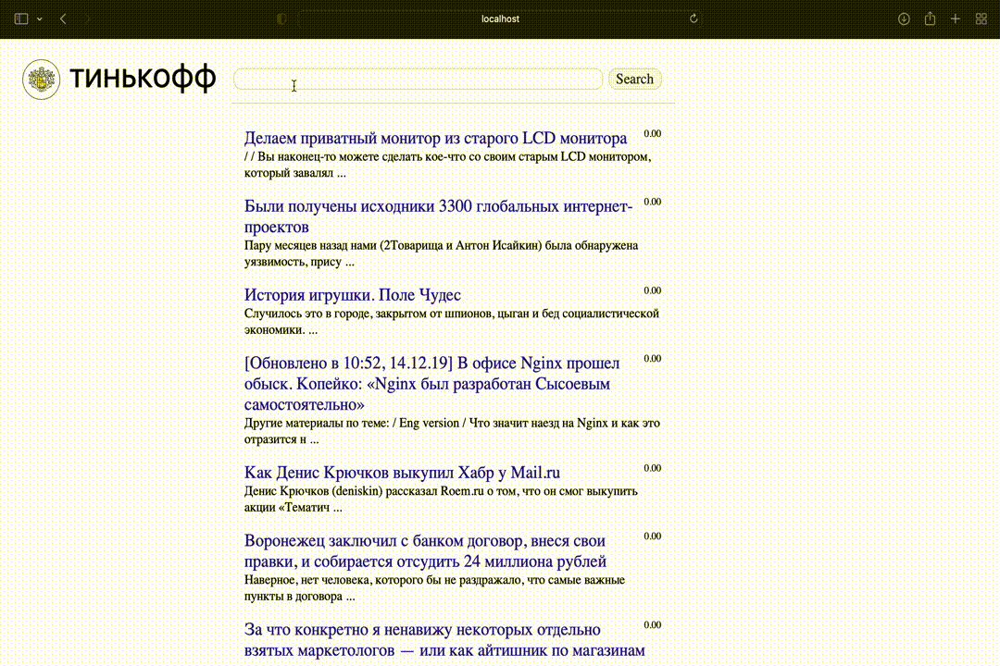

# Информационный поиск по статьям на хабре
Проект по курсам Тинькофф Поколения. Задача информационного поиска.

Данные взял отсюда: https://www.kaggle.com/leadness/habr-posts?select=posts.csv

Когда я обрабатываю данные, я сокращаю количество документов, чтобы это уж много времени не занимало. Получается все равно работа с данными больше 100 мб, там просто много текста. Ну и использую мультипроцессинг.

-Написал обработку данных, стандартно: удаление чисел, пунктуации, стоп-слов, и последущая лемматизация. Размер и сокращенного датасета больше 100 мб, использую мультипроцессинг через swifter. Потом нужные данные дамплю с помощью pickle (он кстати не прям быстро работает, чтение тратит чуток времени).

-В качестве проверки соответствия документа запросу, использую cosine similarity между соответствующими векторами, полученными от tf-idf. Получаю такой score отдельно для заголовков и текста, потом беру их взвешенную сумму. (можно было написать линейную регрессию, но данные не хотелось размечать)

-Использую инвертированный индекс. Пересекаю множества с помощью алгоритма с двумя указателями. Предварительно отсортировал документы по рейтингу.

-Написал функцию precision@k, но никак ее не использую, не хотелось сидеть размечать часть данных.

На 1 запуске надо чуток подождать. Но зато потом все запросы уже будут выполняться очень быстро.

Пример работы:

